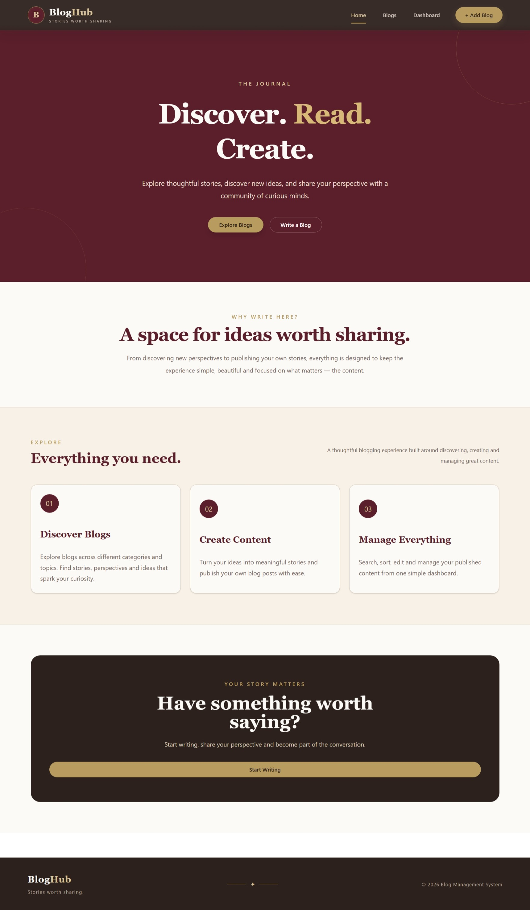
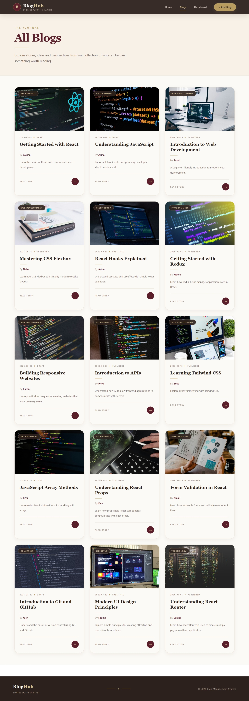
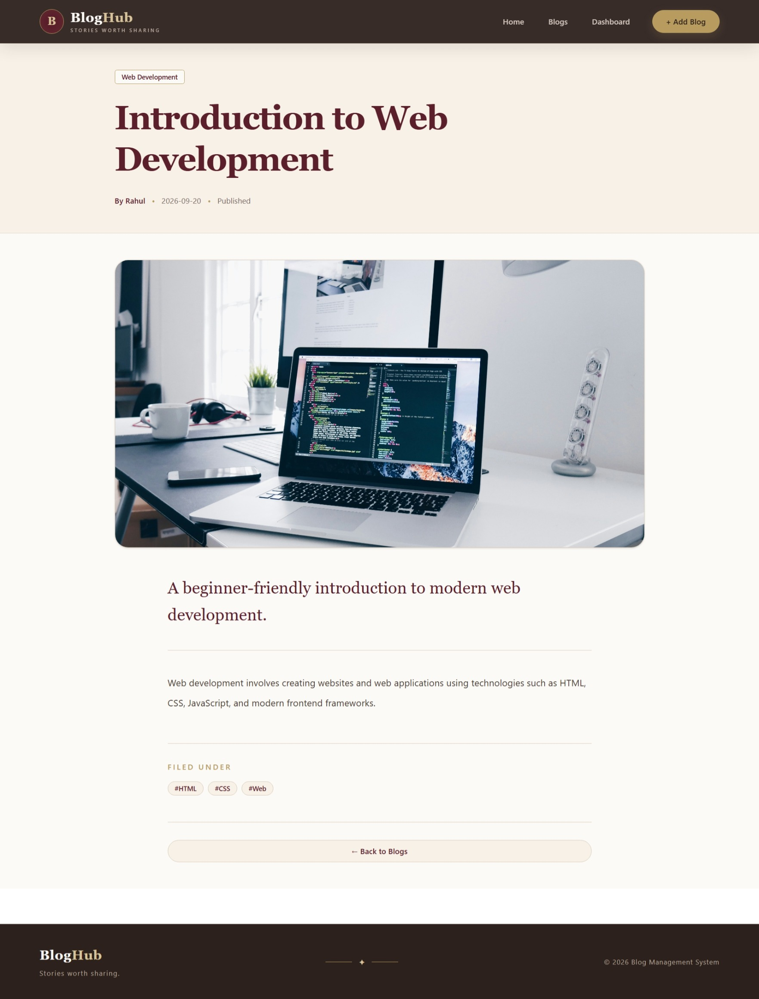
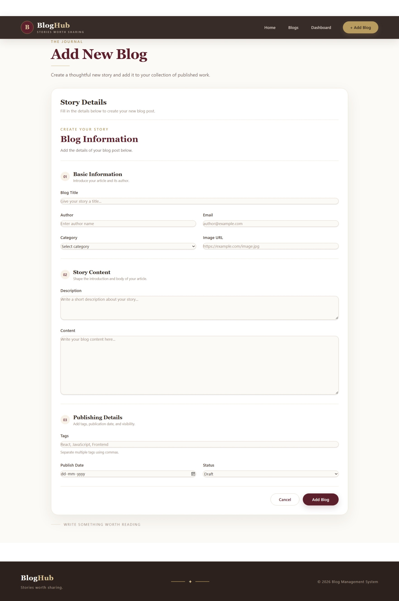
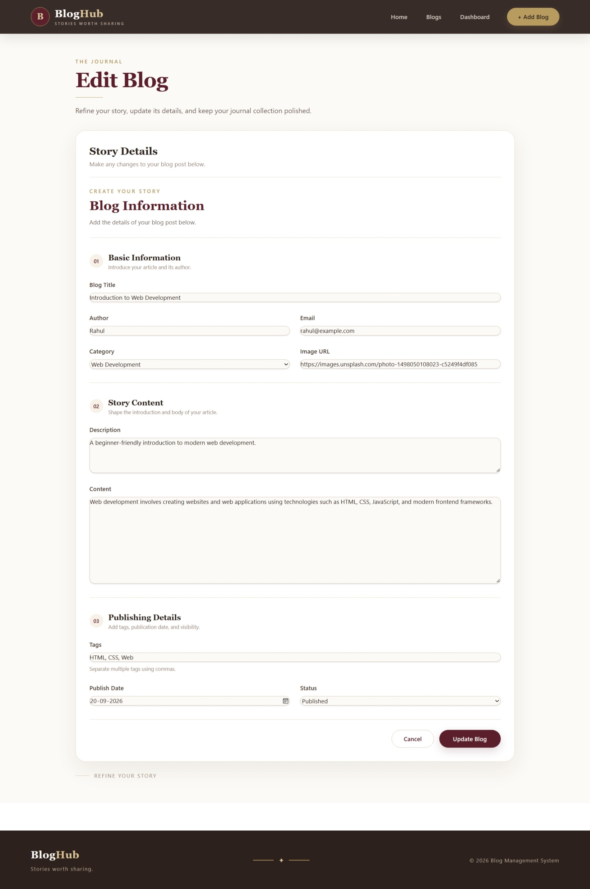
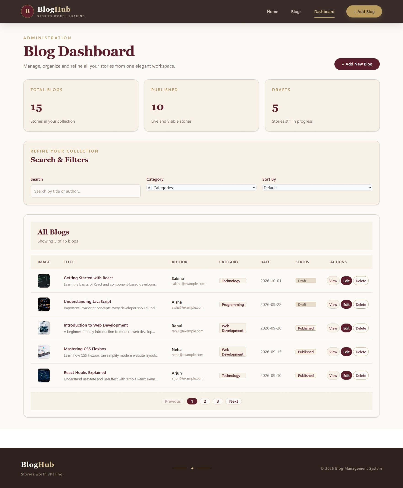

<div align="center">

# 📝 Project : Blog Management System

**A responsive React-based Blog Management System with CRUD operations, Redux state management, search, filtering, sorting, pagination, form validation, routing, and JSON Server API integration.**

</div>

---

## 📑 Table of Contents

* [Project Description](#-project-description)
* [How This Project is Made](#-how-this-project-is-made)
* [Features](#-features)
* [Technologies Used](#-technologies-used)
* [React Concepts Covered](#-react-concepts-covered)
* [How It Works](#-how-it-works)
* [Project Flow](#-project-flow)
* [Project Structure](#-project-structure)
* [CRUD Operations](#-crud-operations)
* [Search Sort Filter Pagination](#-search-sort-filter-pagination)
* [Dashboard](#-dashboard)
* [Form Validation](#-form-validation)
* [Screenshots](#-screenshots)
* [Demo](#-demo)
* [Author](#-author)

---

## 📌 Project Description

Blog Management System is a responsive React application developed to practice and demonstrate important React concepts such as components, JSX, props, state, hooks, forms, validation, routing, CRUD operations, API integration, Redux, searching, sorting, filtering, and pagination.

The application allows users to browse available blog posts, search blogs by title or author, view complete blog details, and navigate through paginated results.

An admin dashboard is also provided for managing blog records. Administrators can add new blogs, edit existing blogs, delete blogs, search records, filter blogs by category, and sort the blog collection.

The project uses **JSON Server** as a simple backend API and **Axios** for HTTP requests. Redux is used to maintain and update the blog state throughout the application.

The interface is designed using **Tailwind CSS and Flowbite React**, with a warm editorial-style visual theme featuring burgundy, cream, beige, espresso, and soft gold colors.

---

## 🚀 How This Project is Made

This project is built using **React**, **Tailwind CSS**, **Flowbite React**, **Redux**, **Axios**, and **JSON Server**.

### 🧱 Component Structure

The application is divided into reusable components and pages.

### Main Components

* **Header** – Provides navigation between Home, Blogs, Dashboard, and Add Blog.
* **Footer** – Displays application branding and footer information.
* **BlogCard** – Displays an individual blog in a reusable card layout.
* **BlogForm** – Reusable form used for both adding and editing blogs.
* **SearchBar** – Allows users to search blogs by title or author.
* **Pagination** – Handles page navigation and displays pagination controls.

### Main Pages

* **Home** – Landing page introducing the blog application.
* **Blogs** – Displays all available blogs in a responsive grid.
* **BlogDetails** – Displays the complete information of a selected blog.
* **Dashboard** – Admin area for managing blog records.
* **AddBlog** – Allows administrators to create a new blog.
* **EditBlog** – Allows administrators to update an existing blog.

---

## ✨ Features

* Responsive editorial-style UI
* Home landing page
* Blog listing page
* Individual blog details page
* Admin dashboard
* Add blog functionality
* Edit blog functionality
* Delete blog functionality
* Search by title or author
* Category filtering
* A-Z sorting
* Z-A sorting
* Latest-to-oldest sorting
* Oldest-to-latest sorting
* Pagination
* Form validation
* Blog status management
* Redux state management
* Axios API integration
* JSON Server backend
* React Router navigation
* Responsive Tailwind CSS design
* Flowbite React components
* Loading and error states
* Success feedback after CRUD operations

---

## 🔧 Technologies Used

### Frontend

* React
* JavaScript ES6+
* React Router DOM
* Redux Toolkit
* Axios
* Tailwind CSS
* Flowbite React

### Backend

* JSON Server
* REST API

### Development Tools

* Vite
* npm
* Git
* GitHub

---

## 📚 React Concepts Covered

This project demonstrates the following concepts:

### Components

Reusable functional components are used throughout the application, including `Header`, `Footer`, `BlogCard`, `BlogForm`, `SearchBar`, and `Pagination`.

### Props

Props are used to pass blog data and callback functions between components.

For example, `BlogCard` receives a `blog` object and `BlogForm` receives properties such as the initial blog data, submit handler, and button text.

### State

React `useState` is used to manage:

* Form data
* Search text
* Selected category
* Sorting option
* Current page
* Loading state
* Error state
* Blog data
* Other UI states

### useEffect

`useEffect` is used for operations such as:

* Fetching blog data from the API
* Updating form data when editing a blog
* Synchronizing component state with API data

### Event Handling

The project handles events such as:

* Form submission
* Input changes
* Search changes
* Filter changes
* Sort changes
* Pagination clicks
* Edit and delete actions

### Conditional Rendering

Conditional rendering is used for:

* Loading states
* Error messages
* Empty blog lists
* Success messages
* Blog status
* Pagination controls

### Array Methods

Methods such as `map`, `filter`, and `sort` are used to display and manipulate blog data.

---

## 🔄 How It Works

### 🏠 Home

The Home page acts as the landing page of the application.

It introduces the Blog Management System and provides navigation to:

* View Blogs
* Admin Dashboard
* Add Blog

The page uses an editorial-style design with a burgundy hero section, cream background, warm beige sections, rounded cards, and gold highlights.

---

### 📚 Blog List

The Blog page retrieves blog records from the JSON Server API.

Each blog is displayed using the reusable `BlogCard` component.

A user can:

* Search blogs
* Browse blog cards
* Open a complete blog
* Navigate through multiple pages

The blog list is responsive and adapts to different screen sizes.

---

### 📖 Blog Details

When a user selects a blog, React Router navigates to:

`/blogs/:id`

The blog ID is obtained using `useParams`.

The application then requests the corresponding blog from the API and displays:

* Blog title
* Author
* Publish date
* Category
* Description
* Full content
* Tags
* Blog image
* Status

---

### 🛠️ Admin Dashboard

The Dashboard is the main management area for administrators.

It displays blog statistics such as:

* Total Blogs
* Published Blogs
* Draft Blogs

The dashboard also provides controls for:

* Searching
* Filtering
* Sorting
* Adding blogs
* Editing blogs
* Deleting blogs
* Viewing blogs
* Pagination

The dashboard combines API data, Redux state, and local UI state to provide a complete blog management experience.

---

### ➕ Add Blog

The Add Blog page uses the reusable `BlogForm` component.

The administrator can enter:

* Blog Title
* Author
* Email
* Category
* Image URL
* Description
* Content
* Tags
* Publish Date
* Status

After validation, the blog is submitted to the JSON Server API using an HTTP POST request.

The new blog is then added to the Redux store and the administrator is redirected back to the Dashboard.

---

### ✏️ Edit Blog

The Edit Blog page uses the route:

`/admin/edit/:id`

The application retrieves the selected blog using its ID.

The existing data is loaded into the reusable `BlogForm`.

After making changes, the administrator can submit the form.

An HTTP PUT request updates the blog on the server, and the updated blog is also reflected in the Redux store.

---

### 🗑️ Delete Blog

The Dashboard provides a delete action for each blog.

When the administrator deletes a blog:

1. The blog ID is identified.
2. A DELETE request is sent to the API.
3. The blog is removed from the Redux store.
4. The dashboard updates automatically.

---

## 🔍 Search, Sort, Filter & Pagination

### Search

Users can search blogs by:

* Blog title
* Author name

The search input dynamically filters the displayed blog collection.

### Category Filter

Blogs can be filtered based on their category.

Examples include:

* Technology
* Programming
* Web Development
* Lifestyle
* Education
* Travel

### Sorting

The dashboard supports multiple sorting options:

* A-Z
* Z-A
* Latest
* Oldest

### Pagination

Pagination divides the blog collection into smaller pages.

The pagination component provides:

* Previous button
* Page numbers
* Next button

This makes it easier to navigate through larger collections of blogs.

---

## 📝 Form Validation

The reusable `BlogForm` validates the required information before submitting a blog.

Validation includes:

* Required blog title
* Required author
* Valid email
* Required category
* Required image
* Required description
* Required content
* Required tags
* Required publish date

If validation fails, an error message is displayed and the form is not submitted.

The same form component is reused for both:

* Adding blogs
* Editing blogs

This avoids unnecessary duplication.

---

## 🔄 CRUD Operations

The project demonstrates all four major CRUD operations.

| Operation | Purpose               | API Method |
| --------- | --------------------- | ---------- |
| Create    | Add a new blog        | POST       |
| Read      | Retrieve blogs        | GET        |
| Update    | Edit an existing blog | PUT        |
| Delete    | Remove a blog         | DELETE     |

Axios is used to communicate with the JSON Server REST API.

---

## 🗺️ Project Flow

```text
                    Blog Management System
                              |
              +---------------+---------------+
              |                               |
            User                            Admin
              |                               |
       +------+-------+              +--------+--------+
       |              |              |        |        |
      Home          Blogs        Dashboard   Add      Edit
                       |              |       Blog     Blog
                    Search           CRUD
                       |              |
                  Blog Details   Search/Sort/
                                 Filter/Pagination
```

---

## 🛣️ Routes

| Route             | Page         | Purpose               |
| ----------------- | ------------ | --------------------- |
| `/`               | Home         | Landing page          |
| `/blogs`          | Blogs        | Display all blogs     |
| `/blogs/:id`      | Blog Details | Display selected blog |
| `/admin`          | Dashboard    | Manage blogs          |
| `/admin/add-blog` | Add Blog     | Create blog           |
| `/admin/edit/:id` | Edit Blog    | Update blog           |

---

## 📂 Project Structure

```text
Blog-Management-System/
│
├── src/
│   ├── components/
│   │   ├── Header.jsx
│   │   ├── Footer.jsx
│   │   ├── BlogCard.jsx
│   │   ├── BlogForm.jsx
│   │   ├── SearchBar.jsx
│   │   └── Pagination.jsx
│   │
│   ├── pages/
│   │   ├── Home.jsx
│   │   ├── Blogs.jsx
│   │   ├── BlogDetails.jsx
│   │   │
│   │   └── admin/
│   │       ├── Dashboard.jsx
│   │       ├── AddBlog.jsx
│   │       └── EditBlog.jsx
│   │
│   ├── redux/
│   │   ├── store.js
│   │   └── blogSlice.js
│   │
│   ├── api/
│   │   └── axios.js
│   │
│   ├── App.jsx
│   └── main.jsx
│
├── db.json
├── package.json
├── vite.config.js
└── README.md
```

---

## 📊 Dashboard

The Dashboard provides an overview of the blog collection.

Example statistics:

```text
┌─────────────────┬─────────────────┬─────────────────┐
│   Total Blogs   │   Published     │     Drafts      │
│       25        │       20        │        5        │
└─────────────────┴─────────────────┴─────────────────┘
```

Administrators can also:

* Add a new blog
* Search blogs
* Filter blogs
* Sort blogs
* View blogs
* Edit blogs
* Delete blogs
* Navigate using pagination

---

## 🎨 UI Design

The application uses a warm editorial visual theme.

### Main Colors

* **Deep Burgundy** – `#5A1F2B`
* **Wine** – `#722F3E`
* **Cream** – `#FCFAF6`
* **Warm Beige** – `#E8DCCB`
* **Espresso** – `#2D211D`
* **Soft Gold** – `#B89B5E`

The design uses:

* Serif typography for editorial headings
* Rounded cards
* Soft shadows
* Warm neutral backgrounds
* Burgundy buttons
* Gold highlights
* Responsive layouts
* Editorial-style spacing

---

## 📸 Screenshots

### Home



### Blog List



### Blog Details



### Add Blog



### Edit Blog



### Dashboard



---

## 🎬 Demo

|                        |                                    |
| ---------------------- | ---------------------------------- |
| 🔗 Live Demo           | Add your deployed project link     |
| 💻 GitHub Repository   | Add your GitHub repository link    |
| 🎥 Project Explanation | Add your project explanation video |

---

## 👩‍💻 Author

<div align="center">

**Sakina Mufaddal Sendhi**

[](https://github.com/sakinasendhi52)

⭐ Thank you for visiting this repository!

</div>
